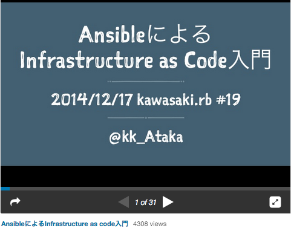

footer: ©2015 @kk_Ataka
slidenumbers: true

# 天と地の狭間で
## 〜なやみましては無限なり〜

---

# Time is money

- 「お金を湯水のように使うことが贅沢だとした場合、時間を無駄に使うことも贅沢である」 [^*1]

[^*1]: 石川昭人(放送作家)
 
---

# 自己紹介
 
- 2009年4月 某大手SIerに入社
- 2015年7月 なつやすみ突入
- 現在に至る

---

# 体壊した

- 体内に悩みをためすぎて自爆した[^*2]

[^*2]: FF3 空手家、3回ためると自爆する。マザーボムの「ば く は つ す る ー ー」と迷った

---

# [fit]天と地の狭間で

---

# 個人的に目指したいこと

1. 楽したい
1. 全社一丸となって顧客と向かいたい
1. サービスを見届けたい

---

# 楽したい

- ダラダラするのは何の苦にもならない
    - 勤務時間自動挿入ツール
        - Selenium
    - e-Learning教科書自動送りツール
        - jsでWebスクレイピング

---

# 楽したい

- 可能性感じたら使ってみたい

---

# 反して、楽するのは難しい

- 導入に政治が必要
- 信じる道を共に歩む仲間を作るのが大変

---

# 全社一丸となって顧客と向かいたい

- 社内で諍いがあっても意味がない
- 「聞いてくれ…ニルダムが滅んだのは国がまとまらなかったからだ。ヴァレリアを一枚岩のように…」 [^*3]

[^*3]: タクティクスオウガ 暗黒騎士アンドラス

---

# 反して、後ろから刺されまくり

- はさみうちだ！(顧客と社内)
- 気づいたら必要な資料が変わってるor増えてる
    - 管理するファイルがドンドン増える
- 情報はPull型のトップダウンで取得
- 司るのは最前線の兵隊

---

# サービスを見届けたい

- 担当したサービスの行く末を見たい [^*4]

[^*4]: サンサーラナーガ2 アムリタ

---

# 反して、見届けられない

- 常に人が足りないプロジェクトを転々
    - 大抵レールが敷かれた後から参画
- 「顧客にソリューションを提供する」のが至上命題なので、中がどうなろうが関係ない
    - それはわかる。でもね

---

# [fit] 環境、キャリア、方向性の違い

---

# [fit] 消化しきれない

---

# 体壊した

- 輪廻

---

# 間

---

# 今の悩みも案外 

- 隣の芝生は青い
- 遅れてきた社二病 [^*5]

-
なのかもしれない。逡巡中

[^*5]: http://d.hatena.ne.jp/Yamashiro0217/20110331/1301542874

---

# 悩むのもエネルギーがいる

- すべて使い果たしている状態だと動けない
- 2行以上の文章が頭に入ってこない
- 思ったことを言語化できない

---

# [fit]そして　なつやすみが　はじまった！

---

# おまけ: Maxヤバい時

- こんな事もやった
