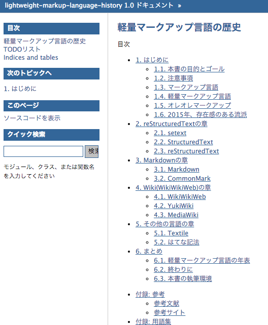
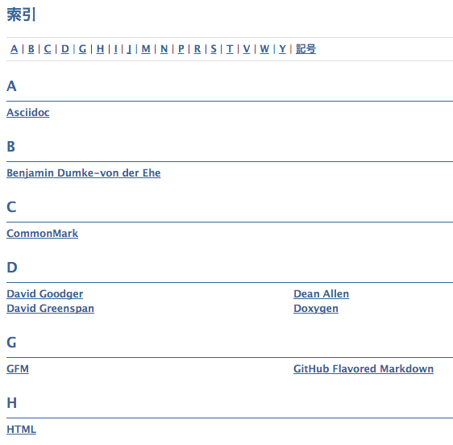
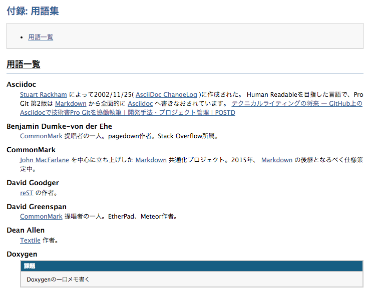
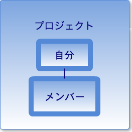
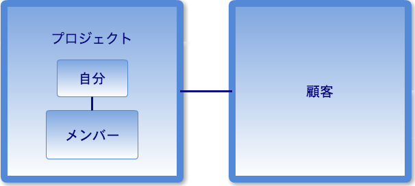
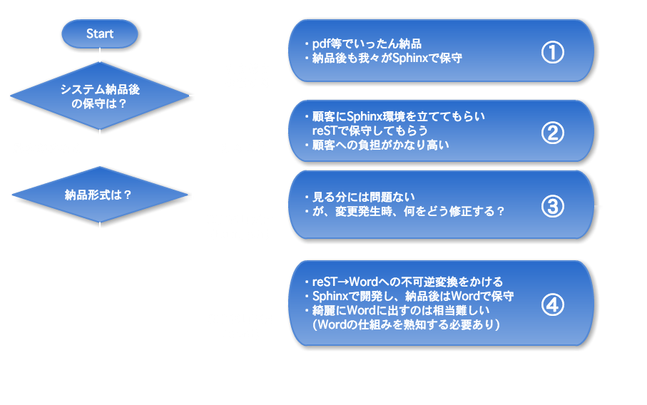

footer: ©2015 @kk_Ataka
slidenumbers: true
autoscale: true
build-lists: true
  
# Sphinx事例紹介<br />〜SIerの場合〜

## 2015/10/31<br />JUS Sphinxワークショップ＠関西

---

# 自己紹介

- Twitter: @kk_Ataka
- GitHub: gosyujin
- SIer勤務
    - Sphinxはプライベートで利用しつつ、仕事にも組み込めないか試行錯誤中

 

---

# アジェンダ

1. Sphinx導入前
    - 導入のための政治活動
1. Sphinx導入中、導入した後
    - 導入するにあたっての壁
    - 「納品」するには
1. Sphinx導入事例

---

# Sphinx導入前

---

# はじめに

- Sphinx(reST)の知名度調査
    - 知名度0！
- Markdownもあんまり
- Wikiはかろうじて多少知られている

まずは政治から

---

# 競合ツールと比較！

- 競合ツールと比較しての良さを調査
    1. Office(Word, Excel)
    1. Wiki, Markdown

※ MarkdownはJekyllやHugoなどMarkdownで記述できる静的サイトジェネレータを想定しています

---

# 比較1<br />Office(Word, Excel)

---

# Office 長所 Word, Excel共通

- SI界のスタンダード
- WYSIWYGな操作
    - きめ細かいデザインが可能
    - 図やフローの挿入が容易

---

# Office 長所 特にWord

- ものすごく複雑な箇条書きが簡単(？)に作れる

```java
  1.1. 設計方針
  1.2. 開発スケジュール
    1.2.1. 要件定義   // => ネストしていく
      1.2.1.1. xx機能  // => さらにネスト…
      1.2.1.2. yy機能   // => 色々書いて…
    1.2.2. 基本設計   // => ネストからの復帰
  1.3. 開発体制       // => さらに復帰
```

---

# Office 長所 特にExcel

- エグい表/テーブルが簡単(？)に作れる
    - 連結、結合たくさんあるマトリクスのようなものとか
    - **Excel方眼紙フォーマット** で自由自在(泣)
- 値の計算が簡単
    - これは表計算ソフトExcelの独壇場
    - 表計算の用途にExcelを使うのは賛成

---

# Office 短所 Word, Excel共通

- diffが取るのがメンドくさい
    - 最近は取れるっぽい
    - 往々にして日付でバージョン管理される事が多い
        - VCSと相性悪し
- 議事録\_20140505\_2(最新)(xx修正).xls

---

# Office 短所 Word, Excel共通

- 検索しづらい
    - 違うシート / 吹出し / 非表示とか
- ミリ単位のレイアウト修正を強いられる
    - 大事なのは内容…そうでしょ！
- 職人芸が発揮されるほど重い
    - 1GBオーバーのファイル…

---

# 比較2<br />Wiki, Markdown

---

# Wiki, Markdownの長所

- Officeの短所は解消できている！…と思う

---

# Wiki, Markdownの長所

```ruby
"diffが取るのがメンドくさい"
```

- Markdownはプレーンテキストなので簡単
    - バージョン管理もしやすい
- Wikiもだいたい差分表示機能あり
    - diff取りやすい

---

# Wiki, Markdownの長所

```ruby
"検索しづらい"
```

- Officeよりは探しやすいと思うのだが…
    - ブラウザ、エディタの検索機能とか、Wiki内検索とかを駆使して

---

# Wiki, Markdownの長所

```ruby
"ミリ単位のレイアウト修正"
```

- 出力先(html+cssなど)である程度統一できる

---

# Wiki, Markdownの短所

- Officeでは特に意識していなかったことを考慮する必要あり

---

# Wiki, Markdownの短所

- 記法を覚える必要がある
    - 未経験者に敷居が高い…
    - 図やフローは基本的にタグで挿入
- 「特定部分のみ」のレイアウト修正が面倒
    - 独自の処理を入れる？面倒…

---

# Wiki, Markdownの短所

- しっかり作らないと情報が散らかる
    - いわゆるTips集になってしまう
- 方言が多い(特にMarkdown)
    - PHP Markdown Extra, GitHub Flavored Markdown etc...
    - パーサが異なると出力結果が変わってしまう
        - 逆に考えると表現方法が増えるため長所になり得る
- 出力はhtmlを想定しているものが多い

---

# そしてSphinx

---

# Sphinxの長所

- Wiki, Markdownの長所と短所はだいたいSphinxにも当てはまる
- Sphinxが強いところは…

---

# Sphinxの長所

- **体系的なドキュメント** の骨組みを **簡単に** 整えられる
    - これだけで導入する価値あり
    - 章の組み換え等も簡単
        - Wikiとかでこれを整備するのはちょっとしんどい
        - Office(Word)はちょっと得意かも
    - 実際に作ってみないと実感がわきづらいと思う



---

# Sphinxの長所

- 複数ページをまたぐのも得意
    - 索引ページ、用語集ページの作成も簡単
- html以外にも出力形式が豊富
    - text, pdf, epub, etc...

---

# 索引ページ

- こんな感じ



---

# 用語集ページ

- こんな感じ



---

# Sphinx導入中<br />と<br />導入した後

---

# 導入するにあたっての壁

---

1. 対、プロジェクトのメンバー(PM)に対して
    - 布教
2. 対、顧客に対して
    - 納品


---

# 壁1. 対PM

---

# 対PM 登場人物

1. 自分
  - Sphinxを導入したい人、基本的になんでもやる
1. プロジェクトのメンバー(PM)
  - 導入したSphinxを使ってほしい人



---

# 対PM 「自分」の仕事

- 「**ドキュメントはreSTで作る**」 明確な宣言
  - 一番大事
  - これがうまく周知されてないと負の成果物が生成される…

---

# 対PM 「自分」の仕事

- メンバーのサポート
    - 「ドキュメント作成するだけ」環境を作る
        1. sphinx-quickstartで下準備
        1. ドキュメント自体のアウトライン作成
        1. doctreeの作成

などなど

---

# 対PM 「自分」の仕事

- ビルド環境、デプロイ環境などもお膳立て
    - ビルドはJenkinsなどで拾う
    - デプロイはWebサーバにhtmlファイル配備とかがお手軽
- commitすれば成果物が生成される事を周知
 
---

# 対PM 「メンバー」の仕事

- reST記法を覚えてもらう

負担を減らす

---

# 対PM 課題

- ローカルPCでのプレビューができない
    - メンバーのPCにSphinxを入れてもらうのは厳しい…
        - 確認できるのがcommitした時のみになってしまう
    - ローカルで簡単にreSTプレビューできない
        - GitHubとか使えばある程度できるんだけど

---

# 対PM 課題

- プロジェクトの風土にあわせたカスタマイズが必要な場合も
    - こういうレイアウトがいい
    - こういうヘッダフッタがほしい
    - 社風にあわせて

---

# 壁2. 対顧客

---

# 対顧客 登場人物

1. プロジェクト
    - Sphinxでドキュメント納品する側
1. 顧客
    - ドキュメントを納品される側
        - 社内の人 or 社外の人
    - 歴史的経緯からOfficeで納品される事が多い
        - 例外はJavadocとか？



---

# 対顧客 「プロジェクト」側の仕事

- 顧客に対して宣言&合意を得る
    - 「今回はOfficeじゃない形式で設計書書きますよ」

---

# 対顧客 「顧客」側の仕事

- 特になし？心構えくらい？

---

# 対顧客 課題

- **納品形式** (次ページ参照)
  - 納品後 **「誰が」** 保守するのか
  - 顧客が巻取ってしまう場合、どう保守すればよいのか
      - 要解決事項
      - これが解決できないと導入できない

---

# 「納品」<br />するには…

---



---

# 自分たちで<br />保守できないと<br />厳しい…

---

# Sphinx導入事例

---

# 環境

- 3ヶ月位のプロジェクトでSphinxを適用
    - ほぼ1人で設計、製造、テストを担当
        - 途中で1人サポートに入ってもらった
    - ドキュメント作成環境は Sphinx + Git(VCS) + Jenkins(Build)
    - ターゲットは「社内資料」
        - 顧客へ納品しない資料

---

# 導入した感想

1. Gitでバージョン管理、テキストなので差分管理も簡単！
1. 内容に集中できる！
1. お目当ての章が見やすい！探しやすい！
1. Outputは、意外と営業の人に受けが良かった！
    - 「これなんてツール？あとで教えて」

---

# まとめ

1. 「Sphinxで書いていく！」空気を作るのが難しい
    - reSTで文章を書いてもらうのも難しい
    - 「仲間」を作ろう！
1. 「納品」するには課題もある
    - お客さんも巻き込もう！
